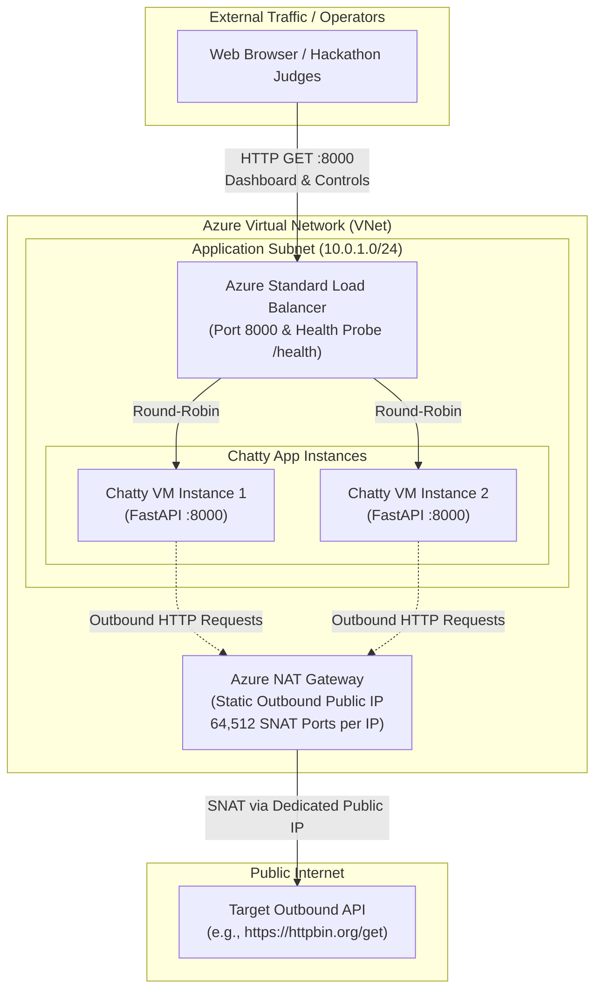

# Azure Chatty Application

> **Demonstrating Outbound SNAT Port Exhaustion and Azure NAT Gateway Scalability**

A lightweight, production-ready Python + FastAPI web application designed for Azure cloud architecture demonstrations, hackathons, and load-testing workshops.

The application allows users to generate controlled bursts of outbound HTTP traffic from Azure Virtual Machines (VMs) or Virtual Machine Scale Sets (VMSS) to observe outbound connection behavior, SNAT (Source Network Address Translation) port limits, and how **Azure NAT Gateway** seamlessly resolves outbound connection bottlenecks.

---

## Architecture Overview



---

## Educational Deep Dive: SNAT & Azure NAT Gateway

### 1. What makes this application "chatty"?
In modern microservice and cloud architectures, an application is considered **chatty** when it:
- Generates a rapid stream of independent, short-lived outbound HTTP/HTTPS requests to external endpoints (e.g., payment gateways, webhook dispatchers, third-party REST APIs, or telemetry sinks).
- Opens multiple concurrent connections rather than pipelining or sharing long-lived connections.
- Closes connections frequently (`Connection: close`), forcing TCP three-way handshakes and teardown cycles for every interaction.

While handling high traffic volumes, chatty applications place enormous stress on the underlying network interface's TCP socket allocation table.

---

### 2. Why many outbound connections create SNAT port pressure
Every outbound TCP connection initiated by an Azure VM to an external Internet IP requires **Source Network Address Translation (SNAT)** to map the VM's private IP (`10.0.x.x`) to an egress Public IP.

A unique outbound connection is defined by a **5-tuple**:
$$\text{Protocol (TCP)}, \quad \text{Source IP}, \quad \text{Source Port}, \quad \text{Destination IP}, \quad \text{Destination Port}$$

- **The Port Ceiling:** Since the destination IP, destination port (e.g., 443), and protocol are often fixed when querying a specific external API, the cloud egress router must allocate a unique ephemeral **Source Port** (between port 1024 and 65535) for each concurrent connection.
- **The TIME_WAIT Trap:** When a TCP connection is closed, the socket enters the `TIME_WAIT` state (typically lasting **2 to 4 minutes** in TCP specifications) to ensure in-flight delayed packets do not corrupt subsequent connections. During this period, that source port cannot be reused for the same destination.
- **Default Azure Limits:** Azure's legacy default outbound access and standard load balancers pre-allocate a **fixed, static allocation of 1,024 SNAT ports per VM instance**.
- **What SNAT Exhaustion Looks Like:** When an application generates hundreds of outbound connections within a 2-minute window, all 1,024 SNAT ports are consumed. New outbound connection requests fail with:
  - `ConnectTimeout` (SYN packets dropped silently by the gateway)
  - Connection refused / drops
  - High application latency spikes
  - `TCP SYN Retransmissions` visible in packet captures

---

### 3. What Azure NAT Gateway DOES
Azure NAT Gateway is a fully managed, highly resilient Network Address Translation service associated directly with one or more subnets:
- **On-Demand Dynamic SNAT Allocation:** Unlike load balancer outbound rules which statically slice ports per VM, NAT Gateway dynamically allocates SNAT ports from a shared pool across all VMs in the subnet as needed.
- **Massive Port Capacity:** Each Public IP address assigned to a NAT Gateway provides **64,512 outbound SNAT ports**. You can assign up to 16 Public IPs per NAT Gateway, giving your subnet over **1,000,000 concurrent SNAT ports**.
- **Predictable Egress Identity:** All outbound traffic from the subnet leaves through the NAT Gateway's static public IP(s), simplifying IP whitelisting with external partners.
- **Flow Inactivity Control:** Configurable TCP idle timeout (4 to 120 minutes) with automatic TCP reset (`TCP RST`) timers.

---

### 4. What Azure NAT Gateway does NOT do
- **No Inbound Connectivity:** NAT Gateway is **strictly outbound**. It cannot receive unsolicited inbound connections from the Internet. Inbound traffic must be routed through an Azure Load Balancer, Application Gateway, or Azure Firewall.
- **No Layer 7 / WAF Filtering:** It operates at Layer 4 (TCP/UDP). It does not perform URL filtering, TLS inspection, header manipulation, or web application firewall (WAF) checks.
- **No Cross-VNet Spanning:** A NAT Gateway cannot be shared across multiple VNets; it is scoped to a single Virtual Network (though it can attach to multiple subnets within that VNet).
- **Does Not Replace Internal VNet Routing:** Traffic between private subnets or over ExpressRoute/VPN bypasses NAT Gateway entirely.

---

### 5. How to Demonstrate This in a Hackathon or Lab

| Phase | Architecture State | Expected Test Behavior |
|---|---|---|
| **Phase 1: Without NAT Gateway** | VM in subnet with standard outbound / default access. | Run test: 1,000 requests @ 50 RPS with Keep-Alive disabled.<br>Observe: Connection timeouts (`ConnectTimeout`), failed requests, and dropped connections after hitting ~1,024 ports. In Azure Portal, check **Virtual Network / VM Metrics $\rightarrow$ SNAT Connection Failures**. |
| **Phase 2: With Azure NAT Gateway** | Attach Azure NAT Gateway to the subnet with 1 Public IP. | Run the exact same test: 1,000 requests @ 50 RPS with Keep-Alive disabled.<br>Observe: **100% success rate**, zero timeouts, consistent low latency, and zero SNAT drops. |

---

## Features

- **Intuitive Web Dashboard (`/`):**
  - Displays the active server hostname (`socket.gethostname()`), making multi-instance VM Scale Set demos crystal clear.
  - Live metric counters: Total requests, Successful requests, Failed requests, Current request rate (req/s), and Average response time (ms).
  - Real-time progress bar and sliding live log table (latest 50 requests with latency & status codes).
  - Error breakdown badges highlighting connection timeouts and HTTP status codes.
- **Configurable Test Parameters:**
  - Target URL (defaults to safe endpoint: `https://httpbin.org/get`, with presets for Cloudflare & Google).
  - Total requests (up to 10,000 safety cap).
  - Requests per second (up to 500 RPS safety cap).
  - Number of concurrent async workers (up to 50 workers).
  - Connection Keep-Alive toggle (force fresh TCP sockets on every request to simulate heavy SNAT pressure).
- **Graceful Stop Button:** Cancel running tests instantly and drain worker tasks cleanly.
- **Standard Azure Health Probe Endpoint:** `GET /health` returns `{"status": "healthy"}` for Azure Load Balancer health checks.
- **Statistics Endpoint:** `GET /stats` returns real-time JSON metrics.
- **Built-in Safety Guardrails:** Hard limits on total requests, rate, concurrency, and a 5-minute auto-timeout prevent accidental runaway traffic or abuse.

---

## Project Structure

```text
chatty-app/
├── app.py              # FastAPI application, async traffic manager, and REST endpoints
├── requirements.txt    # Minimal dependencies (FastAPI, Uvicorn, httpx, Jinja2, pydantic)
├── README.md           # Architecture, SNAT deep-dive, and deployment instructions
└── templates/
    └── index.html      # Responsive Azure-themed dashboard with live telemetry
```

---

## Port Details

- **Application Port:** `8000`
- **Protocol:** HTTP
- **Command:** `uvicorn app:app --host 0.0.0.0 --port 8000`

---

## Running Locally

### Prerequisites
- Python 3.9 or higher
- Git (optional)

### Step-by-Step Instructions

1. **Clone or navigate to the project directory:**
   ```bash
   cd chatty-app
   ```

2. **Create and activate a virtual environment:**
   - **Linux / macOS:**
     ```bash
     python3 -m venv .venv
     source .venv/bin/activate
     ```
   - **Windows (PowerShell):**
     ```powershell
     py -m venv .venv
     .\.venv\Scripts\Activate.ps1
     ```

3. **Install dependencies:**
   ```bash
   pip install -r requirements.txt
   ```

4. **Start the application:**
   ```bash
   uvicorn app:app --host 0.0.0.0 --port 8000 --reload
   ```

5. **Open your browser:**
   - Web Dashboard: [http://localhost:8000](http://localhost:8000)
   - Health Probe: [http://localhost:8000/health](http://localhost:8000/health)
   - Stats API: [http://localhost:8000/stats](http://localhost:8000/stats)

---

## Deploying to an Azure Linux VM

### 1. Provision the Virtual Machine
Create an Ubuntu 22.04 LTS or 24.04 LTS VM in Azure:
```bash
az vm create \
  --resource-group rg-chatty-demo \
  --name vm-chatty-01 \
  --image Ubuntu2204 \
  --admin-username azureuser \
  --generate-ssh-keys \
  --vnet-name vnet-chatty \
  --subnet snet-app \
  --public-ip-address pip-vm-chatty
```

### 2. Configure Network Security Group (NSG)
Allow inbound traffic on port `8000`:
```bash
az network nsg rule create \
  --resource-group rg-chatty-demo \
  --nsg-name vm-chatty-01NSG \
  --name Allow-8000-Inbound \
  --priority 1010 \
  --direction Inbound \
  --access Allow \
  --protocol Tcp \
  --source-address-prefixes '*' \
  --source-port-ranges '*' \
  --destination-address-prefixes '*' \
  --destination-port-ranges 8000
```

### 3. Deploy Application Code on the VM
SSH into the Azure VM and install dependencies:
```bash
ssh azureuser@<VM-PUBLIC-IP>

# Update packages and install python virtual environment
sudo apt-get update
sudo apt-get install -y python3-pip python3-venv git

# Clone or copy application files to /opt/chatty-app
sudo mkdir -p /opt/chatty-app
sudo chown -R azureuser:azureuser /opt/chatty-app
cd /opt/chatty-app

# Copy files (or git clone)
# Then create virtual environment
python3 -m venv venv
./venv/bin/pip install --upgrade pip
./venv/bin/pip install -r requirements.txt
```

### 4. Configure Systemd Service (Production Daemon)
Create a systemd unit file at `/etc/systemd/system/chatty.service`:
```ini
[Unit]
Description=Azure Chatty Application
After=network.target

[Service]
User=azureuser
WorkingDirectory=/opt/chatty-app
ExecStart=/opt/chatty-app/venv/bin/uvicorn app:app --host 0.0.0.0 --port 8000 --workers 2
Restart=always
RestartSec=5
Environment=PYTHONUNBUFFERED=1

[Install]
WantedBy=multi-user.target
```

Enable and start the service:
```bash
sudo systemctl daemon-reload
sudo systemctl enable --now chatty.service
sudo systemctl status chatty.service
```

Access the application at `http://<VM-PUBLIC-IP>:8000`.

---

## Deploying Multiple Instances with Azure VM Scale Set (VMSS)

To demonstrate outbound SNAT behavior across a cluster behind an Azure Standard Load Balancer, use a VM Scale Set with cloud-init:

### 1. Cloud-Init Script (`cloud-init.yaml`)
```yaml
#cloud-config
package_update: true
packages:
  - python3-pip
  - python3-venv
  - git

runcmd:
  - mkdir -p /opt/chatty-app
  - cd /opt/chatty-app
  # Download application code or clone repository here
  - python3 -m venv /opt/chatty-app/venv
  - /opt/chatty-app/venv/bin/pip install fastapi "uvicorn[standard]" httpx jinja2 pydantic
  - |
    cat << 'EOF' > /etc/systemd/system/chatty.service
    [Unit]
    Description=Azure Chatty Application
    After=network.target
    [Service]
    User=root
    WorkingDirectory=/opt/chatty-app
    ExecStart=/opt/chatty-app/venv/bin/uvicorn app:app --host 0.0.0.0 --port 8000
    Restart=always
    [Install]
    WantedBy=multi-user.target
    EOF
  - systemctl daemon-reload
  - systemctl enable --now chatty.service
```

### 2. Configure Azure Standard Load Balancer
- **Frontend IP Configuration:** Public IP or Internal Private IP.
- **Backend Pool:** Add the VMSS instances.
- **Health Probe:**
  - Protocol: `HTTP`
  - Port: `8000`
  - Path: `/health`
  - Interval: `5 seconds`, Unhealthy threshold: `2`
- **Load Balancing Rule:**
  - Frontend Port: `80` (or `8000`)
  - Backend Port: `8000`
  - Health Probe: Reference the `/health` probe created above.

> **Demonstration Tip:** When accessing the application through the Azure Load Balancer, refresh the page or open multiple browser tabs. Notice how the **Server Hostname** badge changes dynamically between instances (`vmss_0`, `vmss_1`, etc.), confirming load distribution!

---

## API Reference

### 1. Health Probe
- **Endpoint:** `GET /health`
- **Description:** Health check probe for Azure Load Balancer and monitoring tools.
- **Response (`200 OK`):**
  ```json
  {
    "status": "healthy"
  }
  ```

### 2. Statistics
- **Endpoint:** `GET /stats`
- **Description:** Real-time metrics and telemetry.
- **Response (`200 OK`):**
  ```json
  {
    "total_requests": 1000,
    "successful_requests": 998,
    "failed_requests": 2,
    "requests_per_second": 50.1,
    "average_response_time_ms": 74.2,
    "min_response_time_ms": 42.1,
    "max_response_time_ms": 280.5,
    "is_running": false,
    "status": "completed",
    "hostname": "azure-chatty-vm-01",
    "target_url": "https://httpbin.org/get",
    "target_total_requests": 1000,
    "target_rps": 50,
    "concurrent_workers": 10,
    "active_workers": 0,
    "elapsed_seconds": 20.0,
    "reuse_connections": true,
    "error_summary": {
      "HTTP 502": 2
    },
    "recent_logs": [
      {
        "id": 1000,
        "time": "14:23:45.120",
        "worker": 4,
        "status": 200,
        "latency_ms": 68.4,
        "success": true,
        "message": "200 OK"
      }
    ]
  }
  ```

### 3. Start Traffic Test
- **Endpoint:** `POST /start`
- **Content-Type:** `application/json`
- **Request Body:**
  ```json
  {
    "target_url": "https://httpbin.org/get",
    "total_requests": 1000,
    "requests_per_second": 50,
    "concurrent_workers": 10,
    "reuse_connections": true
  }
  ```
- **Response (`200 OK`):**
  ```json
  {
    "message": "Traffic generation started successfully",
    "config": {
      "target_url": "https://httpbin.org/get",
      "total_requests": 1000,
      "requests_per_second": 50,
      "concurrent_workers": 10,
      "reuse_connections": true
    }
  }
  ```

### 4. Stop Traffic Test
- **Endpoint:** `POST /stop`
- **Description:** Gracefully stops active background workers.
- **Response (`200 OK`):**
  ```json
  {
    "message": "Stop signal sent to background workers",
    "status": "stopping"
  }
  ```

### 5. Reset Telemetry Counters
- **Endpoint:** `POST /reset`
- **Description:** Resets counters back to zero when idle.
- **Response (`200 OK`):**
  ```json
  {
    "message": "Telemetry counters reset successfully",
    "stats": { ... }
  }
  ```

---

## Safety & Rate Limiting Guardrails

To prevent accidental denial of service (DoS) or unexpected cloud egress costs:
- **Maximum Requests Limit:** 10,000 (configurable via `MAX_ALLOWED_REQUESTS` environment variable)
- **Maximum RPS Limit:** 500 req/sec (configurable via `MAX_ALLOWED_RPS` environment variable)
- **Maximum Workers Limit:** 50 workers (configurable via `MAX_ALLOWED_WORKERS` environment variable)
- **Hard Execution Timeout:** 300 seconds (5 minutes) automatic cancellation per test run
- **Concurrency Guard:** Rejects new `/start` requests with `409 Conflict` if a test is already running on that instance
